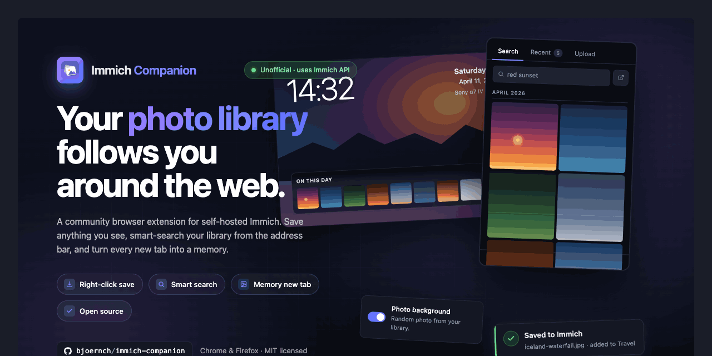

  

  <strong>A community browser extension for self-hosted <a href="https://immich.app">Immich</a>.</strong> 
  Save anything you see on the web, smart-search your library from the toolbar popup, and turn every new tab into a memory.

  Now live in the Chrome Web Store and Firefox Add-ons. The Microsoft Edge Add-ons listing is still in review — until it goes live the Edge button below points at the GitHub <a href="#install">install instructions</a>; Chromium-based browsers including Edge can also install directly from the Chrome Web Store.

  <!-- Store-button images. All bundled locally in webstore-assets/ so the
       README never depends on an external CDN. Edge is still pending; flip
       its href to the live store URL once that listing is approved. -->
  
  &nbsp;
  
  &nbsp;
  

---

## Features

### Save the web to your library
Right-click any image or video on any website to upload it directly to your Immich server. Optionally adds every saved item to a default album.

### Save &amp; share
One click uploads the asset, creates a public Immich share link, and copies it to your clipboard — ready to paste anywhere.

### Smart search, everywhere
- **Toolbar popup** — phone-gallery-style timeline grouped by month, with sticky date headers and a year scrubber on the right edge. Same view for both your most recent items and search results, with quick actions on every photo (copy to clipboard, share link, download original, open in maps).
- **Google search results** — when you Google something, photos in your library that match the query appear in a card at the top of the results. The search runs entirely between your browser and your Immich; nothing is sent to Google.

### New tab as a memory feed
A random photo from your library greets you on every new tab, with an "On this day" strip showing memories from past years. Optional EXIF detail row underneath the date — camera, lens, ISO, aperture, shutter, focal length, dimensions. Pick a specific album as the source, choose an auto-rotate interval, or turn it off entirely.

### Polished little things
Dark and light themes (with system-match), keyboard shortcut (`Ctrl+Shift+L` / `⌘+Shift+L`), connection-status badge on the toolbar icon, in-page upload toasts, share-album toolbar (Slideshow + Download-all) on your Immich `/share/...` URLs, drag-and-drop file uploads, automatic duplicate detection.

---

## Privacy

The extension transmits data **only** to the Immich server you configure. No analytics, no third-party services, no tracking. Your API key stays in `chrome.storage.local` on your device.

→ [Full privacy policy](PRIVACY.md)

---

## Install

- **[Chrome Web Store](https://chromewebstore.google.com/detail/immich-companion/kdgjgohclpdgnhkifmlidoncogokjkkd)** — also covers Edge, Brave, Vivaldi, Arc, Opera and other Chromium-based browsers.
- **[Firefox Add-ons](https://addons.mozilla.org/firefox/addon/immich-companion/)** — Firefox 121 or newer.
- **Microsoft Edge Add-ons** — *pending review.* While the dedicated Edge listing is approved, install via the Chrome Web Store link above; it works in Edge identically.

### After install

The welcome tab opens automatically. You'll need:
- A self-hosted [Immich](https://immich.app) instance you can sign into.
- An API key from your Immich account — Account Settings → API Keys. The welcome page lists the exact required scopes.

The keyboard shortcut `Ctrl+Shift+L` (`⌘+Shift+L` on macOS) opens the popup.

---

## License

[MIT](LICENSE). Unofficial community extension. Not affiliated with the [Immich](https://immich.app) project.
